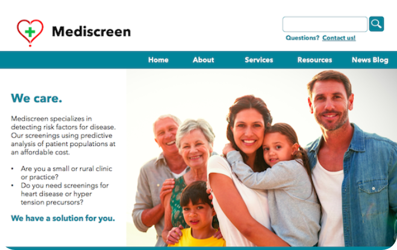

  

<!-- PROJECT LOGO -->
<br />
<div align="center">
    
    <h3 align="center">Mediscreen App<i></i></h3>
    <p align="center">
        We are a solution for you!
        <br />
        <br />
        <a href="#summary"><strong>↓ Explore the docs ↓</strong></a>
        <br />
        <br />
        <a href="https://github.com/s2680854/openclassrooms_9th-project_mediscreen-microservice/issues">Report Bug</a>
        ·
        <a href="https://github.com/s2680854/openclassrooms_9th-project_mediscreen-microservice/issues">Report Feature</a>
        ·
        <a href="mailto:cordial.desk3307@fastmail.com">Contact Me</a>
    </p>
</div>

> # 🛈 For versioning details, please visite '[Releases](https://github.com/s2680854/openclassrooms_9th-project_mediscreen-microservice/releases)' tab.
>

<!-- TABLE OF CONTENTS -->
<details open="open">
<summary id="summary"><b>Table of Contents</b></summary>
    <ol>
        <li><a href="#introduction">Introduction</a></li>
        <li><a href="#acknowledgements">Acknowledgements</a></li>
        <li><a href="#contact">Contact</a></li>
        <li><a href="#project">Project Link</a></li>
    </ol>
</details>

<!-- INTRODUCTION -->
## 📝 Introduction
<p id="introduction"></p>

<div align="center">
    
</div>

### Detect risk factors for disease using predictive analysis of patient populations. This permits to identify the most vulnerable persons to anticipate any critical situation and act quickly to save more lives.

<!-- ACKNOWLEDGEMENTS -->
## 📝 Acknowledgements
<p id="acknowledgements"></p>

* [Project Assignment](https://openclassrooms.com/fr/paths/191/projects/743/assignment)

### Test Cases 1

```curl
curl -d "family=TestNone&given=Test&dob=1966-12-31&sex=F&address=1 Brookside St&phone=100-222-3333" -X POST http://localhost:8081/patient/add
curl -d "family=TestBorderline&given=Test&dob=1945-06-24&sex=M&address=2 High St&phone=200-333-4444" -X POST http://localhost:8081/patient/add
curl -d "family=TestInDanger&given=Test&dob=2004-06-18&sex=M&address=3 Club Road&phone=300-444-5555" -X POST http://localhost:8081/patient/add
curl -d "family=TestEarlyOnset&given=Test&dob=2002-06-28&sex=F&address=4 Valley Dr&phone=400-555-6666" -X POST http://localhost:8081/patient/add
```

### Test Cases 2

```curl
curl -d "patId=1&e=Patient: TestNone Practitioner's notes/recommendations: Patient states that they are 'feeling terrific' Weight at or below recommended level" -X POST http://localhost:8081/patHistory/add
curl -d "patId=2&e=Patient: TestBorderline Practitioner's notes/recommendations: Patient states that they are feeling a great deal of stress at work Patient also complains that their hearing seems Abnormal as of late" -X POST http://localhost:8081/patHistory/add
curl -d "patId=2&e=Patient: TestBorderline Practitioner's notes/recommendations: Patient states that they have had a Reaction to medication within last 3 months Patient also complains that their hearing continues to be problematic" -X POST http://localhost:8081/patHistory/add
curl -d "patId=3&e=Patient: TestInDanger Practitioner's notes/recommendations: Patient states that they are short term Smoker " -X POST http://localhost:8081/patHistory/add
curl -d "patId=3&e=Patient: TestInDanger Practitioner's notes/recommendations: Patient states that they quit within last year Patient also complains that of Abnormal breathing spells Lab reports Cholesterol LDL high" -X POST http://localhost:8081/patHistory/add
curl -d "patId=4&e=Patient: TestEarlyOnset Practitioner's notes/recommendations: Patient states that walking up stairs has become difficult Patient also complains that they are having shortness of breath Lab results indicate Antibodies present elevated Reaction to medication" -X POST http://localhost:8081/patHistory/add
curl -d "patId=4&e=Patient: TestEarlyOnset Practitioner's notes/recommendations: Patient states that they are experiencing back pain when seated for a long time" -X POST http://localhost:8081/patHistory/add
curl -d "patId=4&e=Patient: TestEarlyOnset Practitioner's notes/recommendations: Patient states that they are a short term Smoker Hemoglobin A1C above recommended level" -X POST http://localhost:8081/patHistory/add
curl -d "patId=4&e=Patient: TestEarlyOnset Practitioner's notes/recommendations: Patient states that Body Height, Body Weight, Cholesterol, Dizziness and Reaction" -X POST http://localhost:8081/patHistory/add
```

### Test Cases 3

```curl
curl -d "patId=1" -X POST http://localhost:8081/assess/id
curl -d "patId=2" -X POST http://localhost:8081/assess/id
curl -d "patId=3" -X POST http://localhost:8081/assess/id
curl -d "patId=4" -X POST http://localhost:8081/assess/id
curl -d "familyName=TestNone" -X POST http://localhost:8081/assess/familyName
curl -d "familyName=TestBorderline" -X POST http://localhost:8081/assess/familyName
curl -d "familyName=TestInDanger" -X POST http://localhost:8081/assess/familyName
curl -d "familyName=TestEarlyOnset" -X POST http://localhost:8081/assess/familyName
```

<!-- CONTACT -->
## ✉️ Contact
<p id="contact"></p>

David - [Mail me here!](mailto:cordial.desk3307@fastmail.com)

## 🔗 [» Project Link](https://github.com/s2680854/openclassrooms_9th-project_mediscreen-microservice)
<p id="project"></p>
